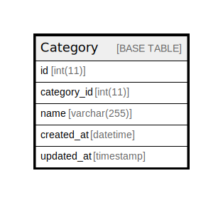

# Category

## Description

<details>
<summary><strong>Table Definition</strong></summary>

```sql
CREATE TABLE `Category` (
  `id` int(11) NOT NULL AUTO_INCREMENT,
  `category_id` int(11) NOT NULL,
  `name` varchar(255) DEFAULT NULL,
  `created_at` datetime DEFAULT current_timestamp(),
  `updated_at` timestamp NOT NULL DEFAULT current_timestamp() ON UPDATE current_timestamp(),
  PRIMARY KEY (`id`),
  UNIQUE KEY `category_id` (`category_id`)
) ENGINE=InnoDB AUTO_INCREMENT=[Redacted by tbls] DEFAULT CHARSET=utf8mb4
```

</details>

## Columns

| Name | Type | Default | Nullable | Extra Definition | Children | Parents | Comment |
| ---- | ---- | ------- | -------- | ---------------- | -------- | ------- | ------- |
| id | int(11) |  | false | auto_increment |  |  |  |
| category_id | int(11) |  | false |  |  |  |  |
| name | varchar(255) | NULL | true |  |  |  |  |
| created_at | datetime | current_timestamp() | true |  |  |  |  |
| updated_at | timestamp | current_timestamp() | false | on update current_timestamp() |  |  |  |

## Constraints

| Name | Type | Definition |
| ---- | ---- | ---------- |
| category_id | UNIQUE | UNIQUE KEY category_id (category_id) |
| PRIMARY | PRIMARY KEY | PRIMARY KEY (id) |

## Indexes

| Name | Definition |
| ---- | ---------- |
| PRIMARY | PRIMARY KEY (id) USING BTREE |
| category_id | UNIQUE KEY category_id (category_id) USING BTREE |

## Relations



---

> Generated by [tbls](https://github.com/k1LoW/tbls)
