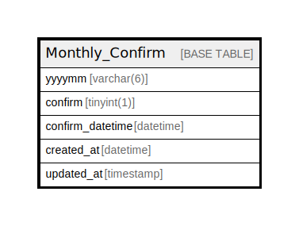

# Monthly_Confirm

## Description

<details>
<summary><strong>Table Definition</strong></summary>

```sql
CREATE TABLE `Monthly_Confirm` (
  `yyyymm` varchar(6) NOT NULL,
  `confirm` tinyint(1) NOT NULL,
  `confirm_datetime` datetime DEFAULT NULL,
  `created_at` datetime DEFAULT current_timestamp(),
  `updated_at` timestamp NOT NULL DEFAULT current_timestamp() ON UPDATE current_timestamp(),
  PRIMARY KEY (`yyyymm`)
) ENGINE=InnoDB DEFAULT CHARSET=utf8mb4 COLLATE=utf8mb4_general_ci
```

</details>

## Columns

| Name | Type | Default | Nullable | Extra Definition | Children | Parents | Comment |
| ---- | ---- | ------- | -------- | ---------------- | -------- | ------- | ------- |
| yyyymm | varchar(6) |  | false |  |  |  |  |
| confirm | tinyint(1) |  | false |  |  |  |  |
| confirm_datetime | datetime | NULL | true |  |  |  |  |
| created_at | datetime | current_timestamp() | true |  |  |  |  |
| updated_at | timestamp | current_timestamp() | false | on update current_timestamp() |  |  |  |

## Constraints

| Name | Type | Definition |
| ---- | ---- | ---------- |
| PRIMARY | PRIMARY KEY | PRIMARY KEY (yyyymm) |

## Indexes

| Name | Definition |
| ---- | ---------- |
| PRIMARY | PRIMARY KEY (yyyymm) USING BTREE |

## Relations



---

> Generated by [tbls](https://github.com/k1LoW/tbls)
