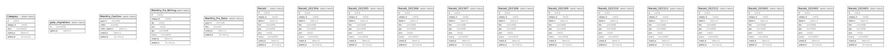

# mawinter

## Tables

| Name | Columns | Comment | Type |
| ---- | ------- | ------- | ---- |
| [Category](Category.md) | 5 |  | BASE TABLE |
| [gorp_migrations](gorp_migrations.md) | 2 |  | BASE TABLE |
| [Monthly_Confirm](Monthly_Confirm.md) | 5 |  | BASE TABLE |
| [Monthly_Fix_Billing](Monthly_Fix_Billing.md) | 8 |  | BASE TABLE |
| [Monthly_Fix_Done](Monthly_Fix_Done.md) | 4 |  | BASE TABLE |
| [Record_200004](Record_200004.md) | 9 |  | BASE TABLE |
| [Record_200005](Record_200005.md) | 9 |  | BASE TABLE |
| [Record_200006](Record_200006.md) | 9 |  | BASE TABLE |
| [Record_200007](Record_200007.md) | 9 |  | BASE TABLE |
| [Record_200008](Record_200008.md) | 9 |  | BASE TABLE |
| [Record_200009](Record_200009.md) | 9 |  | BASE TABLE |
| [Record_200010](Record_200010.md) | 9 |  | BASE TABLE |
| [Record_200011](Record_200011.md) | 9 |  | BASE TABLE |
| [Record_200012](Record_200012.md) | 9 |  | BASE TABLE |
| [Record_200101](Record_200101.md) | 9 |  | BASE TABLE |
| [Record_200102](Record_200102.md) | 9 |  | BASE TABLE |
| [Record_200103](Record_200103.md) | 9 |  | BASE TABLE |
| [Record_YYYYMM](Record_YYYYMM.md) | 9 |  | BASE TABLE |

## Relations

---

> Generated by [tbls](https://github.com/k1LoW/tbls)
